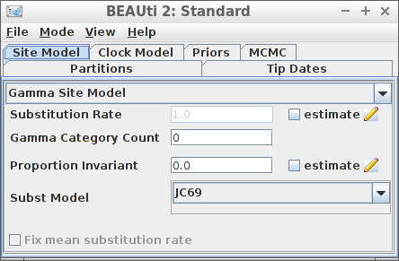

# Examples

## Introduction


This vignette shows some examples how to set up different inference
models in `babette`.

For all examples, do load `babette`:

``` r

library(babette)
```

All these examples check that `BEAST2` is installed at the default
location at /github/home/.local/share/beast/lib/launcher.jar. If this is
not the case, we will use some fabricated output:

``` r

posterior <- create_test_bbt_run_output()
posterior$anthus_aco_sub_trees <- posterior$anthus_aco_trees
names(posterior)
#> [1] "estimates"            "anthus_aco_trees"     "operators"           
#> [4] "output"               "anthus_aco_sub_trees"
```

All examples read the alignment from a FASTA file (usually
`my_fasta.fas`).

``` r

fasta_filename <- get_babette_path("anthus_aco_sub.fas")
```

Instead of a full run, the MCMC chain length is shortened to 10K states,
with a measurement every 1K states:

``` r

mcmc <- create_test_mcmc(chain_length = 10000)
```

We will re-create this MCMC setup, as doing so initializes it with new
filenames for temporary files. These temporary files should not exist
before a run and should exist after a run. Sure, there is the option to
overwrite…

## Example \#1: all default

Using all default settings, only specify a DNA alignment.


Example \#1: all default

``` r

if (is_beast2_installed()) {
  inference_model <- create_inference_model(
    mcmc = mcmc
  )
  beast2_options <- create_beast2_options()
  posterior <- bbt_run_from_model(
    fasta_filename = fasta_filename,
    inference_model = inference_model,
    beast2_options = beast2_options
  )
  bbt_delete_temp_files(
    inference_model = inference_model,
    beast2_options = beast2_options
  )
}
```

All other parameters are set to their defaults, as in BEAUti.

``` r

plot_densitree(posterior$anthus_aco_sub_trees, width = 2)
```


## Example \#2: using an MRCA prior to specify a crown age


Example \#2: using an MRCA prior to specify a crown age

An alternative is to date the node of the most recent common ancestor of
all taxa.

Create the MCMC:

``` r

mcmc <- create_test_mcmc(chain_length = 10000)
```

``` r

if (is_beast2_installed()) {
  inference_model <- create_inference_model(
    mcmc = mcmc,
    mrca_prior = create_mrca_prior(
      taxa_names = sample(get_taxa_names(fasta_filename), size = 3),
      alignment_id = get_alignment_id(fasta_filename),
      is_monophyletic = TRUE,
      mrca_distr = create_normal_distr(
        mean = 15.0,
        sigma = 0.025
      )
    )
  )
  beast2_options <- create_beast2_options()
  posterior <- bbt_run_from_model(
    fasta_filename = fasta_filename,
    inference_model = inference_model,
    beast2_options = beast2_options
  )
  bbt_delete_temp_files(
    inference_model = inference_model,
    beast2_options = beast2_options
  )
}
```

Here we use an MRCA prior with fixed (non-estimated) values of the mean
and standard deviation for the common ancestor node’s time.

``` r

plot_densitree(posterior$anthus_aco_sub_trees, width = 2)
```


## Example \#3: JC69 site model



Example \#3: JC69 site model

``` r

if (is_beast2_installed()) {
  inference_model <- create_inference_model(
    site_model = create_jc69_site_model(),
    mcmc = mcmc
  )
  beast2_options <- create_beast2_options()
  posterior <- bbt_run_from_model(
    fasta_filename = fasta_filename,
    inference_model = inference_model,
    beast2_options = beast2_options
  )
  bbt_delete_temp_files(
    inference_model = inference_model,
    beast2_options = beast2_options
  )
}
```

``` r

plot_densitree(posterior$anthus_aco_sub_trees, width = 2)
```


## Example \#4: Relaxed clock log normal


Example \#4: Relaxed clock log normal

``` r

if (is_beast2_installed()) {
  inference_model <- create_inference_model(
    clock_model = create_rln_clock_model(),
    mcmc = mcmc
  )
  beast2_options <- create_beast2_options()
  posterior <- bbt_run_from_model(
    fasta_filename = fasta_filename,
    inference_model = inference_model,
    beast2_options = beast2_options
  )
  bbt_delete_temp_files(
    inference_model = inference_model,
    beast2_options = beast2_options
  )
}
```

``` r

plot_densitree(posterior$anthus_aco_sub_trees, width = 2)
```


## Example \#5: Birth-Death tree prior


Example \#5: Birth-Death tree prior

``` r

if (is_beast2_installed()) {
  inference_model <- create_inference_model(
    tree_prior = create_bd_tree_prior(),
    mcmc = mcmc
  )
  beast2_options <- create_beast2_options()
  posterior <- bbt_run_from_model(
    fasta_filename = fasta_filename,
    inference_model = inference_model,
    beast2_options = beast2_options
  )
  bbt_delete_temp_files(
    inference_model = inference_model,
    beast2_options = beast2_options
  )
}
```

``` r

plot_densitree(posterior$anthus_aco_sub_trees, width = 2)
```


## Example \#6: Yule tree prior with a normally distributed birth rate


Example \#6: Yule tree prior with a normally distributed birth rate

``` r

if (is_beast2_installed()) {
  inference_model <- create_inference_model(
    tree_prior = create_yule_tree_prior(
      birth_rate_distr = create_normal_distr(
        mean = 1.0,
        sigma = 0.1
      )
    ),
    mcmc = mcmc
  )
  beast2_options <- create_beast2_options()
  posterior <- bbt_run_from_model(
    fasta_filename = fasta_filename,
    inference_model = inference_model,
    beast2_options = beast2_options
  )
  bbt_delete_temp_files(
    inference_model = inference_model,
    beast2_options = beast2_options
  )
}
```

``` r

plot_densitree(posterior$anthus_aco_sub_trees, width = 2)
```


Thanks to Yacine Ben Chehida for this use case

## Example \#7: HKY site model with a non-zero proportion of invariants


Example \#7: HKY site model with a non-zero proportion of invariants

``` r

if (is_beast2_installed()) {
  inference_model <- create_inference_model(
    site_model = create_hky_site_model(
      gamma_site_model = create_gamma_site_model(prop_invariant = 0.5)
    ),
    mcmc = mcmc
  )
  beast2_options <- create_beast2_options()
  posterior <- bbt_run_from_model(
    fasta_filename = fasta_filename,
    inference_model = inference_model,
    beast2_options = beast2_options
  )
  bbt_delete_temp_files(
    inference_model = inference_model,
    beast2_options = beast2_options
  )
}
```

``` r

plot_densitree(posterior$anthus_aco_sub_trees, width = 2)
```


Thanks to Yacine Ben Chehida for this use case

## Example \#8: Strict clock with a known clock rate


Example \#8: Strict clock with a known clock rate

``` r

if (is_beast2_installed()) {
  inference_model <- create_inference_model(
    clock_model = create_strict_clock_model(
      clock_rate_param = 0.5
    ),
    mcmc = mcmc
  )
  beast2_options <- create_beast2_options()
  posterior <- bbt_run_from_model(
    fasta_filename = fasta_filename,
    inference_model = inference_model,
    beast2_options = beast2_options
  )
  bbt_delete_temp_files(
    inference_model = inference_model,
    beast2_options = beast2_options
  )
}
```

``` r

plot_densitree(posterior$anthus_aco_sub_trees, width = 2)
```


Thanks to Paul van Els and Yacine Ben Chehida for this use case.
